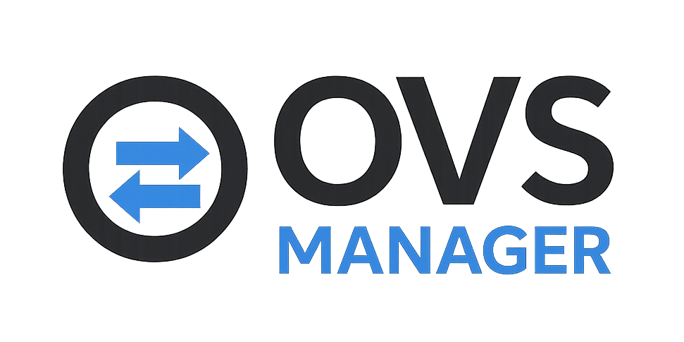
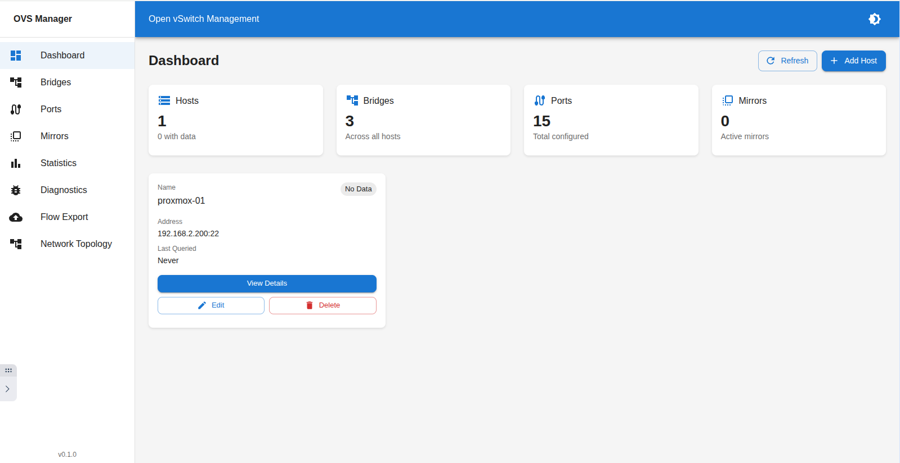
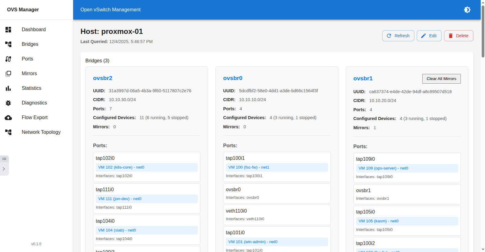
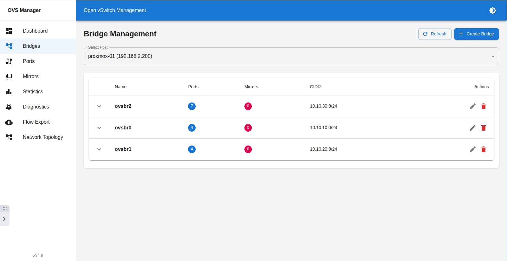
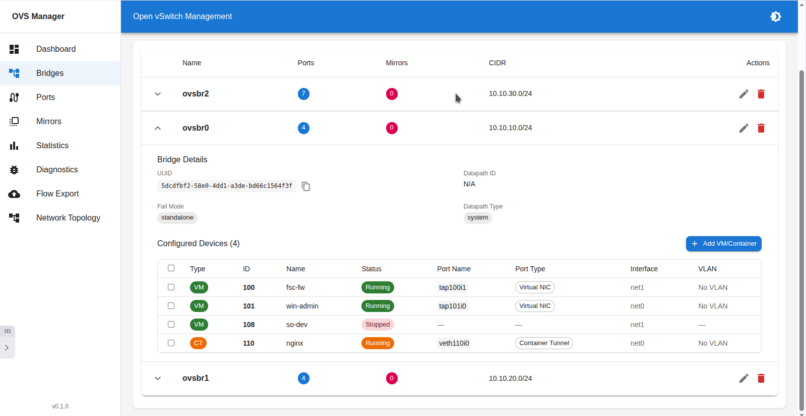
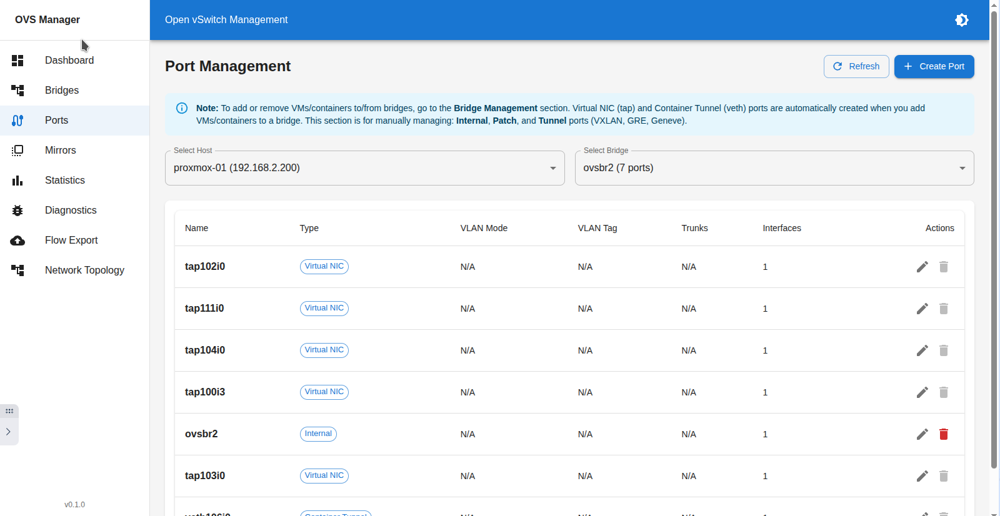
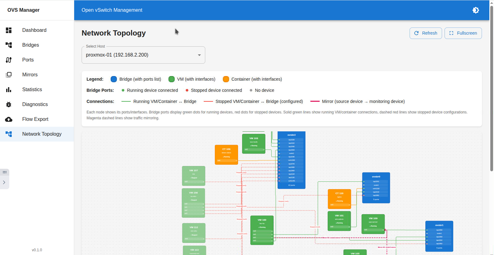
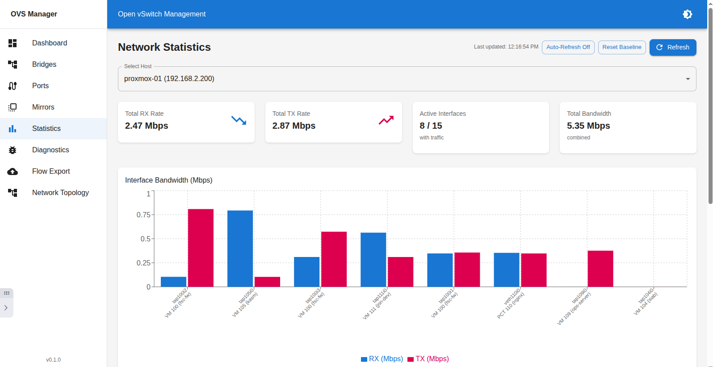
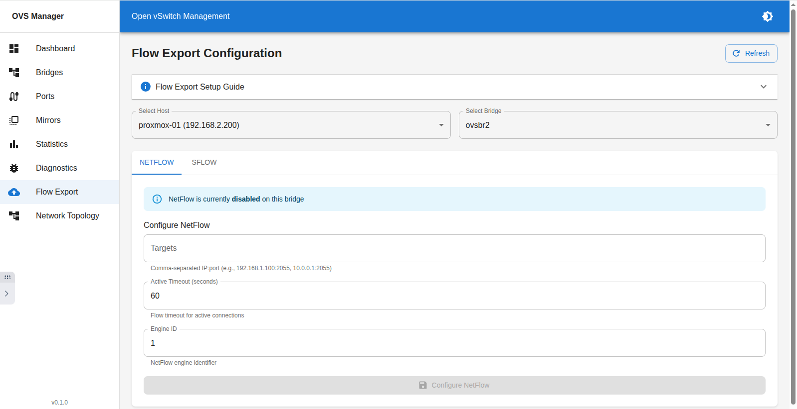
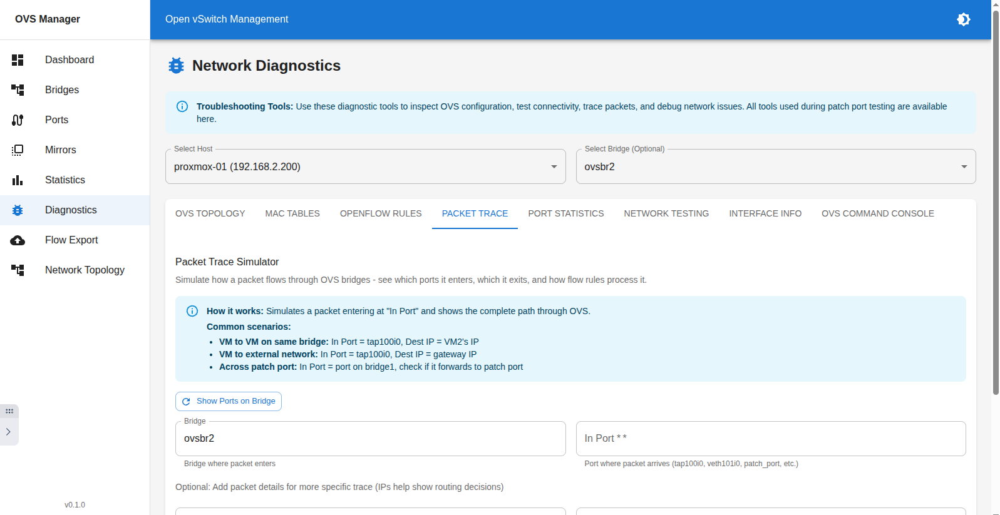

# OVS Manager

A modern web application for managing Open vSwitch (OVS) bridges, mirrors, ports, and VMs across multiple Proxmox hosts.



## Features

- **Multi-Host Management**: Connect to and manage multiple Proxmox hosts remotely via SSH
- **OVSDB Integration**: Direct querying of OVS databases for real-time configuration data
- **Intelligent Caching**: Cache OVS data locally with manual refresh capability
- **Visual Network Topology**: Interactive visualization of bridges, ports, mirrors, and VMs
- **CRUD Operations**: Create, read, update, and delete mirrors, bridges, and port configurations
- **VM Management**: View and manage VM interfaces and their relationships to OVS bridges
- **Flow Export**: Configure NetFlow/sFlow/IPFIX exporters for traffic analysis
- **Port Statistics**: Real-time monitoring of port traffic and performance
- **Diagnostics**: Built-in tools for testing OVS connectivity and configurations

## Architecture

- **Backend**: FastAPI (Python) - RESTful API with OVSDB querying and SSH management
- **Frontend**: React + TypeScript - Modern, responsive UI with network visualization
- **Database**: SQLite - Local caching of OVS configurations
- **Deployment**: Docker Compose - Containerized services

## Quick Start

### Prerequisites

- Docker and Docker Compose installed
- SSH access to your Proxmox hosts
- OVS tools installed on Proxmox hosts (`openvswitch-switch` package)

### Setup Steps

#### Option 1: Using Pre-built Images (Recommended)

Pre-built Docker images are automatically published to GitHub Container Registry:

1. **Pull and Start Services**:
   ```bash
   docker compose pull
   docker compose up -d
   ```

The images are automatically pulled from:
- `ghcr.io/jongodb/ovs-manager-backend:latest`
- `ghcr.io/jongodb/ovs-manager-frontend:latest`

#### Option 2: Building from Source

1. **Build and Start Services**:
   ```bash
   docker compose up -d --build
   ```

2. **Access Application**:
   - Frontend: http://localhost:3000
   - Backend API: http://localhost:8000
   - API Docs: http://localhost:8000/docs

3. **Add Proxmox Hosts via UI**:
   - Click "Add Host" button on the dashboard
   - Fill in the host details:
     - Host Name (unique identifier)
     - Hostname/IP Address
     - SSH Port (default: 22)
     - Username (typically "root")
     - Authentication method (SSH Key or Password)
     - Description (optional)
   - Click "Create Host"

4. **SSH Key Setup** (Recommended):
   ```bash
   # Generate SSH key if needed
   ssh-keygen -t rsa -b 4096 -f ~/.ssh/ovs_manager_key

   # Copy key to Proxmox host
   ssh-copy-id -i ~/.ssh/ovs_manager_key.pub root@proxmox-host

   # Use the key path when adding the host in the UI
   ```

5. **View Logs**:
   ```bash
   docker-compose logs -f
   ```

## Usage Guide

### Dashboard



The Dashboard provides a high-level overview of your OVS infrastructure:

- **Summary Statistics**: Total hosts, bridges, ports, mirrors, and VMs
- **Host List**: All configured Proxmox hosts with status indicators
- **Quick Actions**: Add new hosts, refresh data, navigate to host details
- **Health Status**: Visual indicators showing host connectivity status

**Key Features:**
- Color-coded host status (green = connected, red = error, gray = unknown)
- Last queried timestamp for each host
- Quick navigation to detailed host views

**Tips:**
- Use the "Refresh" button to update cached data from all hosts
- Click on any host card to view detailed information
- Delete hosts you no longer need using the trash icon

---

### Host Detail View



Access detailed information about a specific Proxmox host:

**Sections:**
1. **Bridge List**: All OVS bridges with port counts and CIDR information
2. **Mirror List**: Active port mirrors with source/destination details
3. **Virtual Machines**: All VMs with their network interfaces and bridge connections
4. **Linux Containers**: All LXC containers with their network configurations

**Bridge Visualization:**
- Visual representation of bridge hierarchy
- Configured devices (VMs and containers) with status indicators
- Port connections and interface mappings

**Key Features:**
- Live status indicators (Running = green, Stopped = red)
- Port name mappings (tap devices for VMs, veth for containers)
- Interface identifiers (net0, net1, etc.)
- Quick identification of stopped devices

**Tips:**
- Use "Refresh" to get the latest data from the host
- Stopped devices show "—" for port names since they have no active OVS port
- All configured devices are visible regardless of power state

---

### Bridge Management



Comprehensive bridge configuration and management interface:

**Features:**
- **Create Bridges**: Configure new OVS bridges with full settings
- **Edit Bridges**: Modify bridge parameters (fail mode, STP, RSTP, multicast snooping)
- **Delete Bridges**: Remove bridges (with safety checks)
- **Configured Devices Table**: View all VMs and containers assigned to each bridge

**Bridge Configuration Options:**
- **Name**: Bridge identifier (e.g., vmbr1, ovsbr0)
- **Fail Mode**: `standalone` (default) or `secure`
- **Datapath Type**: `system` (kernel) or `netdev` (userspace)
- **IPv4/IPv6**: CIDR notation and gateway configuration
- **Bridge Ports**: Physical interfaces to add
- **MTU**: Maximum transmission unit (1500-9000)
- **STP/RSTP**: Spanning Tree Protocol options
- **Multicast Snooping**: Enable/disable IGMP snooping

**Configured Devices Table:**



Shows **all** VMs and containers configured for each bridge with columns:
- **Type**: VM (green) or CT/Container (orange)
- **ID**: VMID or CTID
- **Name**: Device name
- **Status**: Running or Stopped with color indicators
- **Port Name**: Active OVS port name (tap/veth) or "—" for stopped devices
- **Port Type**: Virtual NIC, Container Tunnel, etc.
- **Interface**: Network interface ID (net0, net1, etc.)
- **VLAN**: Access port, trunk port, or no VLAN

**Device Management:**
- **Add VM/Container**: Attach devices to bridges with network configuration
- **Remove Devices**: Detach devices from bridges (works for both running and stopped)
- **Bulk Operations**: Select multiple devices for batch removal

**Tips:**
- Checkboxes appear for all devices (running and stopped) - you can remove interfaces even when powered off
- Use "Select All" to quickly choose all devices
- Bridge names must start with a letter (no hyphens allowed)
- IPv4 validation enforces proper CIDR format (e.g., 10.0.0.1/24)
- Clear all mirrors using the failsafe button if individual deletion fails

---

### Port Management



View and configure individual OVS ports:

**Features:**
- **Port Listing**: All ports across all bridges
- **VLAN Configuration**: Set access or trunk VLANs
- **Port Statistics**: Real-time traffic metrics
- **Device Mapping**: Which VM/container uses each port

**Port Types:**
- **Virtual NIC** (tap): VM network interfaces
- **Container Tunnel** (veth): LXC container interfaces
- **Internal**: Bridge internal ports
- **Physical**: Physical network interfaces
- **Patch**: Connections between bridges
- **Tunnel**: VXLAN, GRE, Geneve, LISP, STT

**Configuration:**
- Set VLAN tags (access mode for single VLAN)
- Configure trunk ports (multiple VLANs)
- View port statistics and performance metrics

**Tips:**
- Port names follow patterns: `tap{vmid}i{interface#}` for VMs, `veth{ctid}i{interface#}` for containers
- Use port statistics to identify traffic bottlenecks
- Trunk ports show all allowed VLANs

---

### Mirror Management


Create and manage port mirrors for traffic monitoring and analysis:

**What is Port Mirroring?**
Port mirroring (also called SPAN - Switched Port Analyzer) copies traffic from one or more source ports to a destination monitoring port. This allows you to:
- Monitor network traffic without interruption
- Send traffic to analysis tools (Wireshark, Suricata, etc.)
- Implement intrusion detection systems (IDS)
- Perform network troubleshooting

**Mirror Configuration:**
- **Name**: Descriptive identifier for the mirror
- **Bridge**: Target OVS bridge
- **Output Port**: Destination port (monitoring device)
- **Source Ports**:
  - **Select All**: Mirror all traffic on the bridge
  - **Specific Ports**: Choose individual source ports
  - **Source/Destination**: Mirror TX, RX, or both directions
- **Statistics**: Track mirrored packets and bytes

**Types of Mirroring:**
- **Ingress (RX)**: Captures incoming traffic
- **Egress (TX)**: Captures outgoing traffic
- **Bidirectional**: Captures both directions

**Mirror Workflow:**
1. Create a VM/container as your monitoring device
2. Note its tap/veth port name (output port)
3. Create mirror and select source ports to monitor
4. Traffic flows to monitoring device for analysis

**Tips:**
- Use descriptive mirror names (e.g., "IDS-Monitor-VLAN100")
- "Select All" is useful for monitoring entire bridge traffic
- Monitoring devices see copied traffic without affecting original flows
- Delete mirrors that are no longer needed to reduce overhead
- Use the "Clear All Mirrors" failsafe button if normal deletion fails

---

### Network Topology



Interactive visual representation of your OVS network:

**Visualization Elements:**
- **Bridges**: Purple rectangles showing bridge names
- **Virtual Machines**: Green circles with VM IDs and names
- **Containers**: Orange circles with container IDs and names
- **Connections**: Lines showing port-to-bridge relationships
- **Mirror Paths**: Dashed pink lines showing mirrored traffic flows

**Device Status Indicators:**
- **Running Devices**: Full opacity, solid green/orange borders
- **Stopped Devices**: Faded (60% opacity), dashed red borders
- **Port Names**: Displayed on connection lines

**Interactive Features:**
- **Zoom**: Mouse wheel or pinch gestures
- **Pan**: Click and drag background
- **Node Drag**: Move nodes to organize layout
- **Fullscreen**: Expand topology to full screen
- **Auto-Layout**: Automatically organizes nodes

**Understanding the Topology:**
- Devices connect to bridges via their network interfaces
- Stopped devices show configured connections with dashed lines
- Mirror relationships display as dashed pink lines from source to monitoring device
- All configured devices appear regardless of power state

**Tips:**
- Use fullscreen mode for complex topologies
- Drag nodes to create a logical layout
- Stopped devices are still connected to their configured bridges
- Mirror edges show traffic flow direction
- Refresh to update topology after configuration changes

---

### Statistics Dashboard



Real-time monitoring and performance metrics:

**Metrics Displayed:**
- **Port Statistics**: Packets, bytes, errors, drops for each port
- **Traffic Rates**: RX/TX rates in packets/second and bytes/second
- **Error Rates**: Error and drop percentages
- **Baseline Comparison**: Compare current metrics to saved baseline

**Features:**
- **Set Baseline**: Snapshot current statistics for comparison
- **Reset Baseline**: Clear saved baseline
- **Auto-Refresh**: Continuously updated metrics
- **Historical Data**: Track changes over time

**Key Metrics:**
- **RX (Receive)**: Incoming traffic statistics
- **TX (Transmit)**: Outgoing traffic statistics
- **Errors**: Packet transmission errors
- **Drops**: Dropped packets (buffer overflow, etc.)

**Tips:**
- Set a baseline during normal operation to identify anomalies
- High error rates may indicate physical layer issues
- Drop counts suggest buffer or congestion problems
- Use statistics to validate mirror configurations

---

### Flow Export Configuration



Configure NetFlow, sFlow, and IPFIX exporters for traffic analysis:

**What is Flow Export?**
Flow export protocols send network traffic metadata to collectors for analysis:
- **NetFlow**: Cisco's flow export protocol (v5, v9, v10/IPFIX)
- **sFlow**: Sampled flow protocol for high-speed networks
- **IPFIX**: Internet Protocol Flow Information Export (NetFlow v10 standard)

**Configuration Options:**
- **Protocol**: NetFlow, sFlow, or IPFIX
- **Collector IP**: Destination for flow data
- **Collector Port**: UDP port (default: 2055 for NetFlow, 6343 for sFlow)
- **Active Timeout**: Flow export interval (seconds)
- **Sampling Rate**: sFlow packet sampling ratio (e.g., 1:512)

**Use Cases:**
- **Traffic Analysis**: Understand network usage patterns
- **Security Monitoring**: Detect anomalies and threats
- **Capacity Planning**: Identify bandwidth requirements
- **Billing/Accounting**: Track per-tenant usage

**Tips:**
- Use sFlow for high-traffic environments (lower overhead)
- NetFlow v9/IPFIX support templates for flexible data export
- Sampling rates balance detail vs. performance
- Ensure collector firewall rules allow inbound UDP traffic

---

### Diagnostics



Built-in troubleshooting and testing tools:

**Available Diagnostic Commands:**
- **ovs-vsctl show**: Display complete OVS configuration
- **ovs-vsctl list Bridge**: List all bridges with detailed properties
- **ovs-vsctl list Port**: List all ports with configurations
- **ovs-vsctl list Interface**: List all interfaces with statistics
- **ovs-vsctl list Mirror**: List all mirrors with settings
- **ovs-ofctl dump-flows**: Display OpenFlow rules
- **ovs-appctl**: Direct AppCtl commands to OVS daemons

**Features:**
- **Command Execution**: Run OVS commands remotely via SSH
- **Output Display**: View command results in formatted text
- **Error Reporting**: Clear error messages for troubleshooting
- **Multiple Hosts**: Test commands on any configured host

**Common Diagnostic Scenarios:**
- Verify bridge creation: `ovs-vsctl show`
- Check mirror status: `ovs-vsctl list Mirror`
- Debug flow issues: `ovs-ofctl dump-flows <bridge>`
- View port statistics: `ovs-vsctl list Interface`

**Tips:**
- Use diagnostics to verify UI operations
- Check flow rules if traffic isn't forwarding correctly
- Monitor interface statistics to identify link issues
- Run commands on multiple hosts to compare configurations

---

## Configuration

### Host Management

Hosts are managed entirely through the web UI with no configuration files required:

**Adding Hosts:**
1. Navigate to Dashboard
2. Click "Add Host"
3. Enter host details:
   - **Name**: Unique identifier (e.g., "proxmox-1")
   - **Hostname**: IP address or FQDN
   - **Port**: SSH port (default: 22)
   - **Username**: SSH user (typically "root")
   - **Auth Method**: SSH Key (recommended) or Password
   - **Description**: Optional notes
4. Save

**SSH Key Authentication (Recommended):**
```bash
# Generate SSH key pair
ssh-keygen -t rsa -b 4096 -f ~/.ssh/ovs_manager_key

# Copy public key to Proxmox host
ssh-copy-id -i ~/.ssh/ovs_manager_key.pub root@proxmox-host

# In OVS Manager UI, select "SSH Key" and enter key path:
# /root/.ssh/ovs_manager_key (container path)
# or use password for initial setup
```

**Password Authentication:**
- Less secure than SSH keys
- Suitable for testing environments
- Password stored encrypted in database

**Editing/Deleting Hosts:**
- Edit: Update hostname, port, credentials, or description
- Delete: Removes host from OVS Manager (does not affect actual Proxmox configuration)

---

### Environment Variables

Configure OVS Manager behavior via environment variables in `docker-compose.yml`:

**Backend Configuration:**
- `DATABASE_URL`: SQLite database path (default: `sqlite:///./ovs_manager.db`)
- `ALLOWED_ORIGINS`: CORS allowed origins (comma-separated, default: "*")

**Frontend Configuration:**
- Built-time configuration embedded in React app
- Proxy configured via `package.json` for API requests

**Example Production Configuration:**
```yaml
environment:
  - DATABASE_URL=sqlite:///./data/ovs_manager.db
  - ALLOWED_ORIGINS=https://ovs-manager.example.com,https://ovs.example.com
```

---

## Tips & Tricks

### Performance Optimization

**Caching Strategy:**
- OVS Manager caches all data locally
- Use "Refresh" only when you need updated information
- Cached data reduces load on Proxmox hosts

**Managing Large Environments:**
- Use descriptive bridge and mirror names
- Organize bridges by purpose (e.g., "ovsbr-prod", "ovsbr-dev")
- Regular cleanup of unused mirrors reduces overhead

### Best Practices

**Bridge Naming:**
- Start with letters (no hyphens): `ovsbr0`, `vmbr10`, `bridgeProd`
- Use consistent naming conventions across hosts
- Include VLAN or purpose in name for clarity

**Mirror Configuration:**
- Limit "Select All" mirrors to short-term troubleshooting
- Prefer specific port mirrors for ongoing monitoring
- Use descriptive names indicating purpose

**Security:**
- Always use SSH keys over passwords
- Restrict network access to OVS Manager ports
- Regular SSH key rotation
- Monitor diagnostic command usage

**VM/Container Network Management:**
- Stopped devices can be added/removed from bridges
- Test network changes on stopped devices before powering on
- Use Network Topology to visualize impact before changes

### Troubleshooting

**Host Won't Connect:**
- Verify SSH credentials in Diagnostics
- Check firewall rules (port 22)
- Ensure OVS is installed: `apt install openvswitch-switch`
- Test manual SSH connection

**Mirror Not Working:**
- Verify output port is on same bridge as source ports
- Check monitoring device is running
- Ensure output port has active interface
- Use Diagnostics to verify mirror in OVS: `ovs-vsctl list Mirror`

**Missing VMs/Containers:**
- Click "Refresh" to update cached data
- Verify devices have network interfaces configured
- Check Proxmox host connectivity
- Stopped devices should still appear with red status

**Statistics Not Updating:**
- Verify host connection status
- Check that ports exist in OVS
- Reset baseline if comparisons seem incorrect

---

## API Documentation

Full API documentation with interactive testing available at:
- **Swagger UI**: http://localhost:8000/docs
- **ReDoc**: http://localhost:8000/redoc

The API provides programmatic access to all OVS Manager features including:
- Host management (CRUD operations)
- Bridge operations
- Port and mirror configuration
- VM and container information
- Flow export configuration
- Statistics and diagnostics

---

## Docker Images

### Pre-built Images

OVS Manager provides pre-built Docker images via GitHub Container Registry (GHCR):

**Latest stable release:**
```bash
docker pull ghcr.io/jongodb/ovs-manager-backend:latest
docker pull ghcr.io/jongodb/ovs-manager-frontend:latest
```

**Specific versions:**
```bash
docker pull ghcr.io/jongodb/ovs-manager-backend:v0.1.0
docker pull ghcr.io/jongodb/ovs-manager-frontend:v0.1.0
```

### Automated Builds

Images are automatically built and published when:
- Code is pushed to the `main` branch (tagged as `latest`)
- Version tags are created (e.g., `v1.0.0`, tagged with semantic version)

The build process:
1. Builds both frontend and backend images
2. Runs multi-stage builds for optimized image sizes
3. Uses Docker layer caching for faster builds
4. Publishes to GHCR with automatic tagging

**Build Status:** Check the [Actions tab](https://github.com/JongoDB/OVS-Manager/actions) for build status

### Image Details

**Backend Image:**
- Base: Python 3.11 slim
- Size: ~200MB
- Contains: FastAPI, SQLAlchemy, SSH clients, OVS tools

**Frontend Image:**
- Base: Node 18 Alpine
- Size: ~150MB (production)
- Contains: Pre-built React app served with `serve`
- Multi-stage build for minimal production size

### Using Custom Images

To use your own registry or build custom images:

```yaml
# docker-compose.yml
services:
  backend:
    image: your-registry.com/ovs-manager-backend:custom-tag
    build:
      context: ./backend

  frontend:
    image: your-registry.com/ovs-manager-frontend:custom-tag
    build:
      context: ./frontend
      target: production
```

---

## License

This project is licensed under the MIT License - see below for details:

```
MIT License

Copyright (c) 2025 OVS Manager Contributors

Permission is hereby granted, free of charge, to any person obtaining a copy
of this software and associated documentation files (the "Software"), to deal
in the Software without restriction, including without limitation the rights
to use, copy, modify, merge, publish, distribute, sublicense, and/or sell
copies of the Software, and to permit persons to whom the Software is
furnished to do so, subject to the following conditions:

The above copyright notice and this permission notice shall be included in all
copies or substantial portions of the Software.

THE SOFTWARE IS PROVIDED "AS IS", WITHOUT WARRANTY OF ANY KIND, EXPRESS OR
IMPLIED, INCLUDING BUT NOT LIMITED TO THE WARRANTIES OF MERCHANTABILITY,
FITNESS FOR A PARTICULAR PURPOSE AND NONINFRINGEMENT. IN NO EVENT SHALL THE
AUTHORS OR COPYRIGHT HOLDERS BE LIABLE FOR ANY CLAIM, DAMAGES OR OTHER
LIABILITY, WHETHER IN AN ACTION OF CONTRACT, TORT OR OTHERWISE, ARISING FROM,
OUT OF OR IN CONNECTION WITH THE SOFTWARE OR THE USE OR OTHER DEALINGS IN THE
SOFTWARE.
```

---

## Contributing

Contributions are welcome! Please feel free to submit issues, feature requests, or pull requests.

---

## Support

For issues, questions, or feature requests, please open an issue on the project repository.
